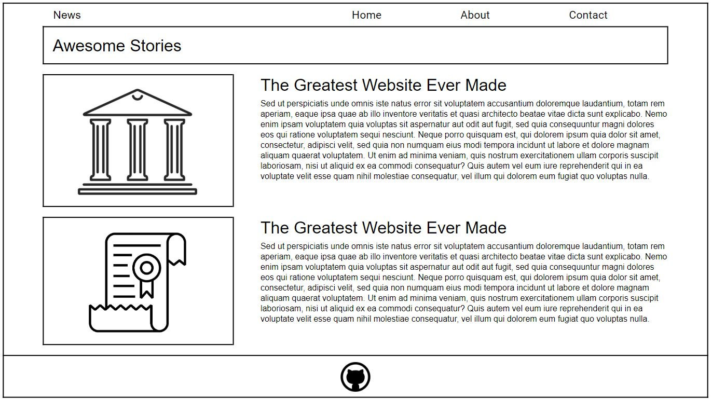

# Blog Layout with Bootstrap

Practice activity in creating a layout using Bootstrap 4.

## Getting Started

- Add a `link` element to include the Bootstrap 4 CSS from a cdn to index.html.
- "Eyeball" the wireframe to identify rows and columns to create the layout of
  the page.
- Use Bootstrap 4 grid to create a layout that is close to the layout of the
  wireframe. The layout does not need to match perfectly.
- Use placeholder text and placeholder images as you see fit.

## Wireframe

